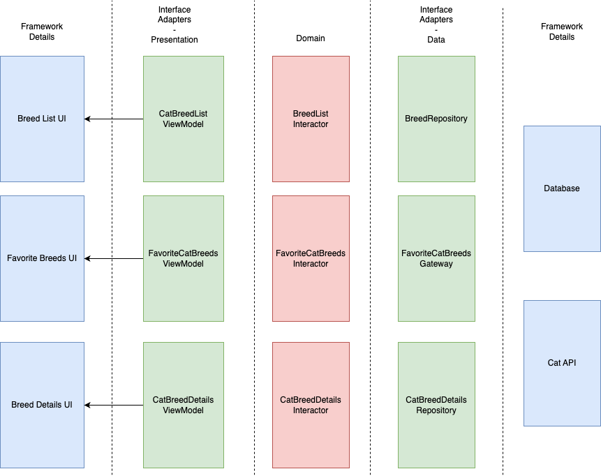

# Cat Breeds App

The implementation of the project follows Clean Architecture principles.
In the domain layer we have the domain entity, CatBreed. That entity is managed and handled by use case interactors, which contain the implementation of the use cases of the app.
I opted to make the interactors into state machines that contain a representation of the current state of the application and expose a `Flow` of states to the presentation layer, inspired by MVI/Redux and Jake Wharton's talk [Managing State with RxJava](https://www.youtube.com/watch?v=0IKHxjkgop4).

The domain layer also contains the definition of interfaces that the use cases use to fetch/store data somewhere.

Those interfaces are implemented in the Interface Adapters layer, responsible for providing a concrete implementation to the domain needs declared in the interfaces above mentioned.
It is in this layer that we use real implementations from the framework, namely  Retrofit to fetch data from the network and Room to persist data.

In the Presentation layer, which also belongs to the Interface Adapters layer, I used AAC ViewModel as requested but any pattern (MVP, MVC, MVI, etc.) would fit here.
In the UI layer, which belongs to the framework details, I used Jetpack Compose.

Below is a diagram of an overview of the architecture

# Testing strategy
I opted to implement three types of tests, Unit, Integration and Component (more details: https://martinfowler.com/bliki/ComponentTest.html).
The unit tests were implemented to test the domain and presentation logic and the strategy was to test the use cases in isolation to ensure the business logic is correct. ViewModels were also tested using unit tests.
The integration tests test the integration of all layers, excluding UI and data. The choice here was to test from the POV of the view model, mocking only the data layer. 

Finally, the component tests were implemented to ensure that the app works as expected as a whole. These tests are close to E2E, but we replace the data layer with test doubles we can control.
For these tests, I opted to create a simple fake database instead of using Room since I didn't find an easy way to manipulate the contents of the DB during tests (we can run SQL directly in the DB but that would take a lot of time to implement).
To simulate the API calls I used MockWebServer. This way there is no flakyness in case the real API is down.

I did not use any mocking library and I opted for Fake test doubles instead. In my opinion, mocks lead to tests that know way too much about the implementation details and make refactoring harder.

During the development I used TDD which guided the way I implemented most things and had the side effect of producing a lot of unit tests. I started by the domain layer and went outwards.
The component tests were implemented later to validate the acceptance criteria of the requirements asked.

# Decisions Made

- The UI is very basic, since I suck at coming up with good designs :sweat_smile: and because I chose to focus on architecture and tests.
- There are some tests missing, namely integration tests for the data layer. I didn't have time to implement them all but included a few to serve as example on how I would do it.
- There is no nice way to navigate from a bottom navigation graph to a non-bottom navigation one. I tried nested navigation graphs, but couldn't make it work. Given this I opted to open the details screen inside the main scaffold.
- I didn't have time to implement pagination. We can discuss how I would implement it in the next phase!
